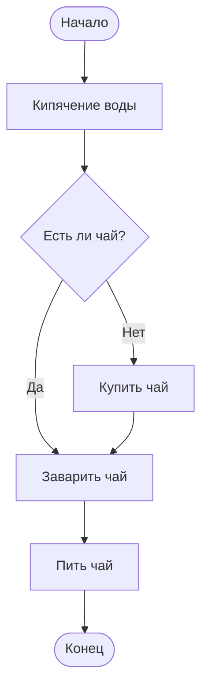
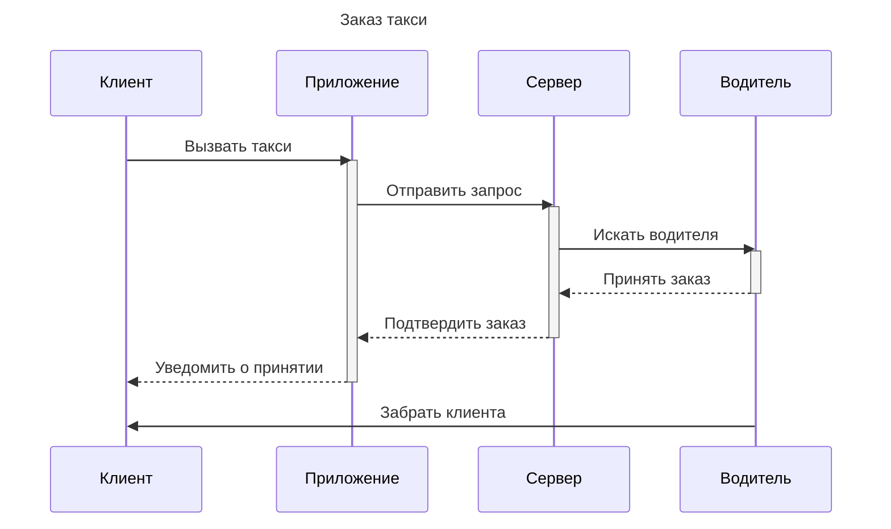
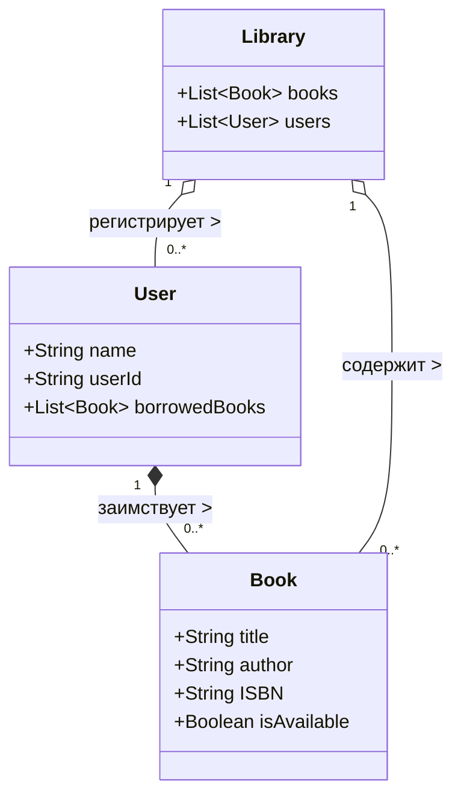
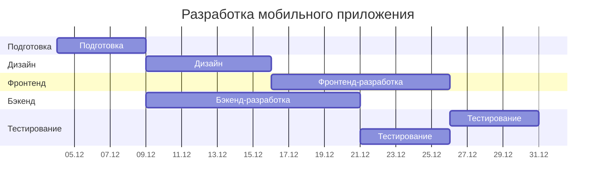
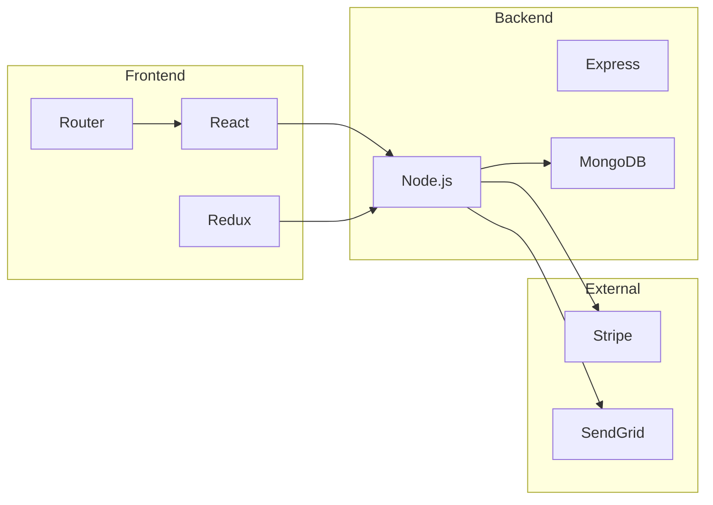
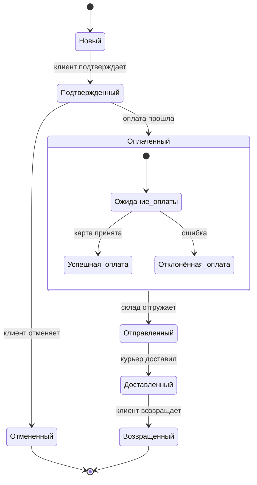
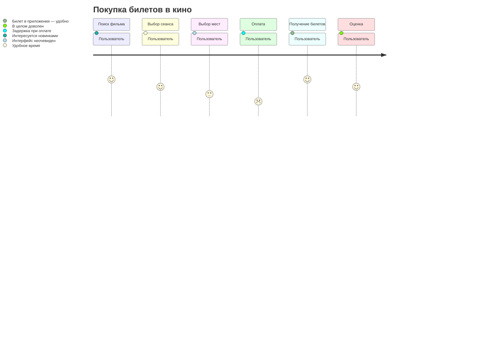
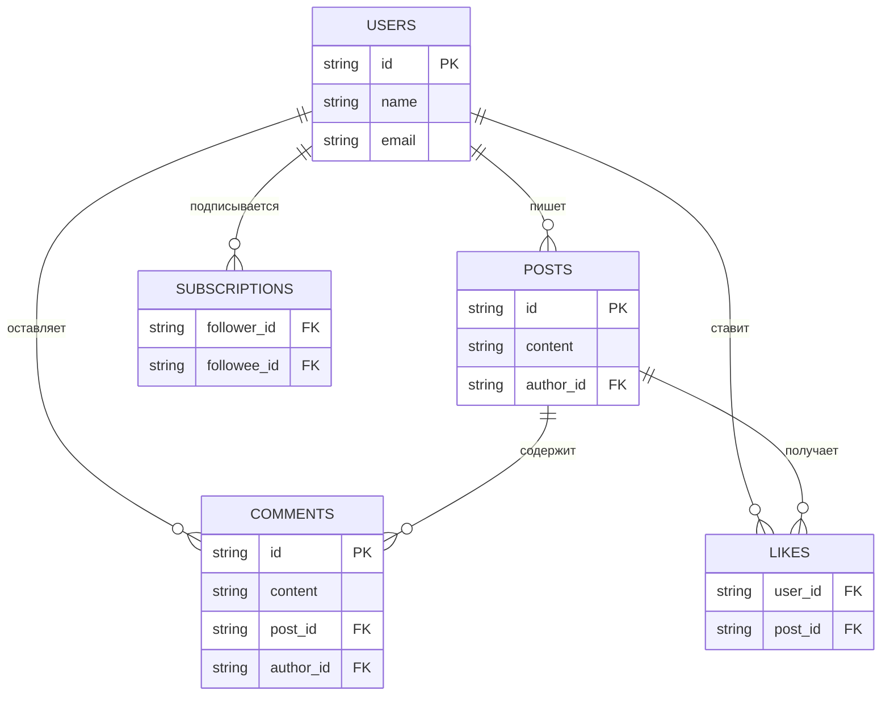
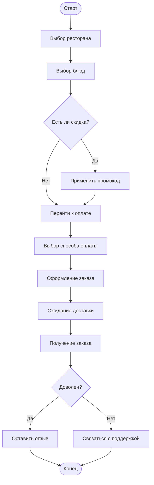
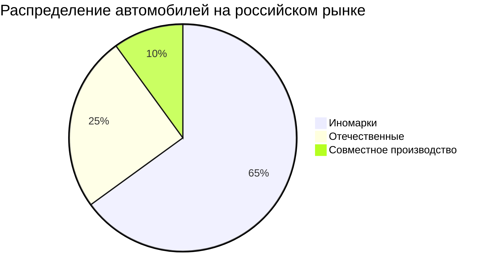

# Mermaind
Бакшилов Никита ИПо8482

                            Ex. 1 Начальный

Ex. 1.1

Ex. 1.2

                          Ex. 2 Средний

Ex. 2.1

Ex. 2.2

                            Ex. 3 Продвинутый

Ex. 3.1

Ex. 3.2

                            Ex. 4 Экспертный уровень

Ex. 4.1

Ex. 4.2

                            Ex. 5 Блок-схема
                            
Ex. 5.1

                        Ex. 6 Круговая диаграмма

